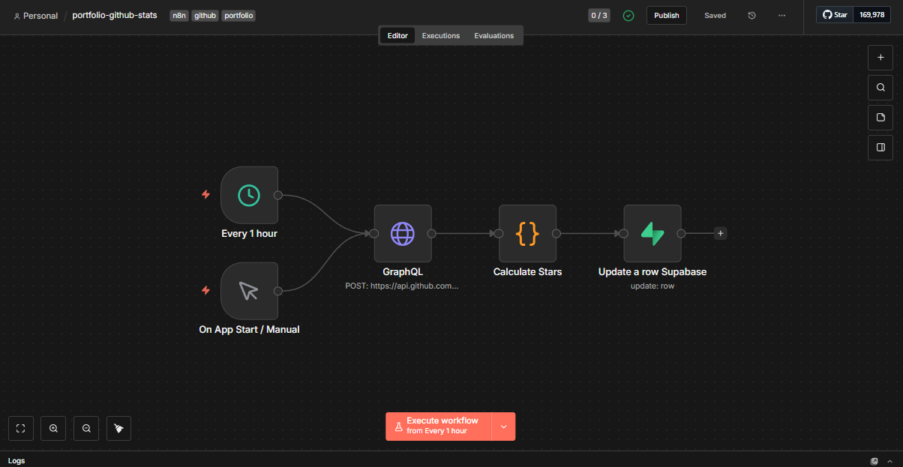

# 🤖 GitHub Stats Automation with n8n & Supabase


[](https://opensource.org/licenses/MIT)
[](https://ridwansuryantara.netlify.app)

**Automated tracking of GitHub profile statistics such as total stars, repositories, followers, and contributions using n8n with data stored in Supabase.**

## 📖 Overview

This repository hosts an n8n workflow designed to track your open-source impact on GitHub. It runs on a schedule (every 1 hour) to fetch profile data using GitHub's GraphQL API, calculates aggregated metrics (like total stars across all repos), and updates the statistics in a Supabase database.

## 📸 Workflow Preview



## ✨ Features

* **Automated Scheduling:** Runs automatically every 1 hour or on app start.
* **GraphQL Integration:** Uses GitHub GraphQL API to fetch complex data structures in a single request.
* **Data Aggregation:** Calculates metrics that aren't directly available via simple API calls:
    * ⭐ **Total Stars:** Iterates through all repositories to sum up earned stars.
    * 👥 **Followers:** Tracks total follower count.
    * 📦 **Repositories:** Tracks number of public repositories.
    * 🟩 **Contributions:** Tracks total contributions in the last year.
* **Data Storage:** Processes and updates the corresponding row in **Supabase**.

## 🛠️ Tech Stack

* **Automation:** [n8n](https://n8n.io/) (Self-hosted/Cloud)
* **Database:** [Supabase](https://supabase.com/) (PostgreSQL)
* **Source:** GitHub GraphQL API

## 🚀 How to Use

### 1. Import Workflow
* Download the `.json` file from this repository.
* Open your n8n editor.
* Click the menu (top right) and select `Import from File`.

### 2. Configure Nodes

Follow the steps below to configure each node with your own GitHub Credentials and Database details.

#### ⏰ Schedule (Every 1 Hour)
* Set the **Trigger Interval** (e.g., Every 1 Hour) based on how often you want to track data.

#### 🌐 GraphQL (Get GitHub Stats)
* **Method:** `POST`
* **URL:** `https://api.github.com/graphql`
* **Authentication:**
    * Select **Predefined Credential Type** -> **GitHub API**.
    * Create a new credential and authenticate with your **GitHub Account** (OAuth or Personal Access Token).
    * *Note:* The query uses the `viewer` object, so it will automatically fetch stats for the authenticated user.
* **Query:**
    * The workflow includes a pre-configured GraphQL query to fetch followers, repositories, and contribution history. No manual change is needed here unless you want additional data.

#### 🧮 Calculate Stars
* This node runs JavaScript code to process the GraphQL response.
* It loops through your repositories (`data.repositories.nodes`) to calculate the **Total Stars** count, as GitHub does not provide this as a single metric.

#### 💾 Update a row Supabase
* **Operation:** `Update`
* **Table:** `platform_stats` (or your specific table name).
* **Authentication:**
    * Select **Predefined Credential Type** -> **Supabase API**.
    * Select your credentials.
* **Update Condition:**
    * The workflow is set to update a row where `platform` equals `'github'`.
    * *Important:* Ensure you have a row in your database with the column `platform` set to `github` before running this, or switch the operation to "Upsert".

### 3. Activate
* Toggle the workflow to **Active** in the top right corner.

## 📝 Data Structure

The workflow prepares a JSON object similar to this before sending to Supabase:

```json
{
  "followers": 150,
  "repos": 42,
  "stars": 340,
  "contributions": 1250,
  "platform": "github"
}
